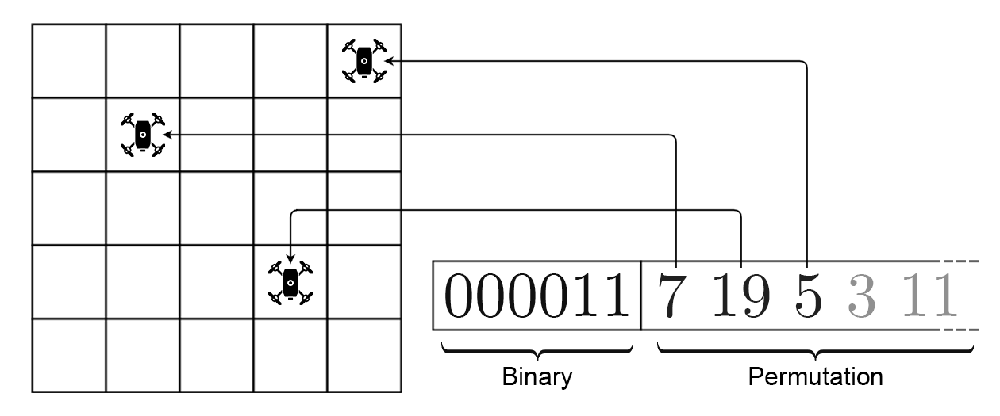
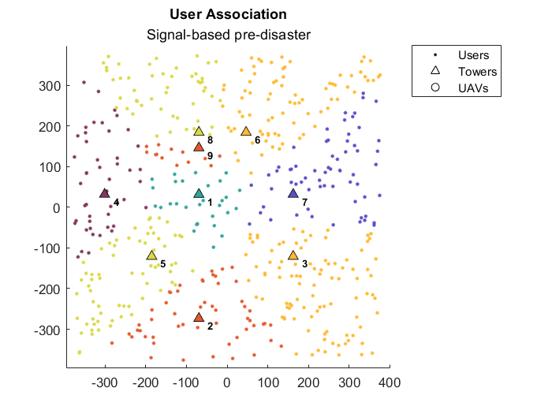
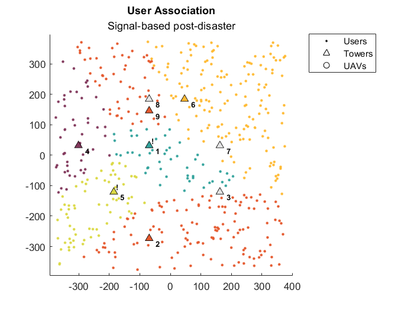
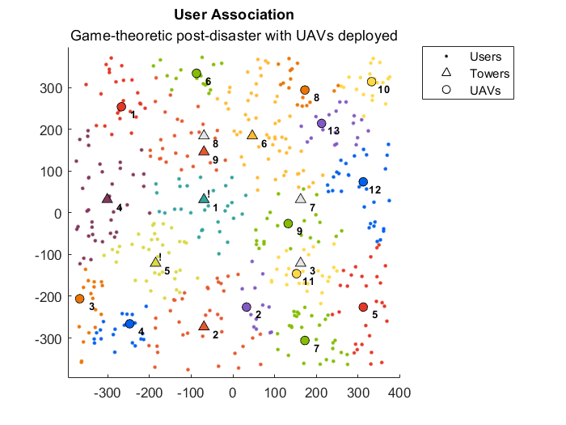
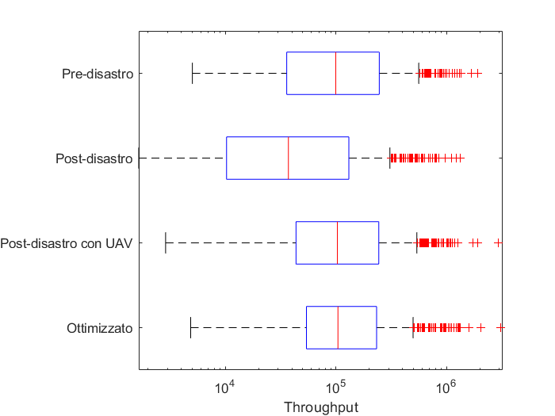

# Game-Theorethic management of UAV-empowered disaster-resilient networking

The availability of communication channels able to offer a good level of quality of service is pivotal after the
occurrence of a disaster in order to share critical info or to coordinate search and rescue operations.

With the developments in both Smart City and 5G paradigms new communication opportunities arise thanks to ad-hoc networks
among smartphones and surviving IoT devices, cellular networks as well as wireless networks based on vehicles.

With all these opportunities, the choice of the communication medium to use to access the Internet by the user equipment
must consider the quality of service achievable through each of them, while reducing the amount of energy consumed for
communicating, given that it might not be possible to have access to energy sources.

This work evaluates the adoption of Game Theory to find association strategies that maximize the quality of service
perceived in post-disaster scenarios in which UAVs have been deployed to support the cellular network.

## System model

In order to evaluate the adoption of Game Theory in these scenarios, a scheme for the placement of tower cells,
users and UAVs must be defined, as well as failure models.

### Tower placement

The placement of static base stations is not uniform on the territory but depends on the density of both population and
buildings and this is why this project relies on real info provided by the [OpenCelliD](https://www.opencellid.org)
project.

This database provides many details, including the GPS coordinates of cell towers placed all around the world by network
operators. The translation of these coordinates into points of the plane is achieved through the
[latlon2local](https://mathworks.com/help/driving/ref/latlon2local.html) MATLAB function.

### User placement

The placement of network users in the area considered is modeled through an uniform distribution, even though this might
not necessarily represent what happens in a real scenario. This choice is due to the lack of a widely appreciated model
for network users placement in a well-defined area after the occurrence of a disaster.

### Failure models

The models adopted for failures are a geographically-correlated one to mimic the effects of natural disasters on the
network infrastructure, and a stochastic model for man-made disasters.

The impact of disasters on the network are modeled as a limitation to the maximum utilization of each of the towers
affected.

### UAVs placement

The number of UAVs and the positions where to place them in a particular area are determined with a Genetic Algorithm
that assigns a score to each solution through a cost function that depends on the number of UAVs it uses, the amount of
energy consumed by the entire system and the quality of service perceived by the users.

Each solution is represented by a chromosome divided into a binary and a permutative component, with the first
representing the number of UAVs used and the latter indicating the actual positions where to place them.

### Throughput optimization

This work relies on the adoption of Game Theory for the optimization of the quality of service perceived by the users
after the occurrence of a disaster.

In particular, a non-cooperative game has been developed where each user aims to maximize his throughput by choosing to
connect to one of the available base stations but not necessarily the one that is delivering the strongest signal.

## Results

To evaluate the results achievable with such a process, here follows a simulation using network info regarding Vodafone
IT infrastructure in the area of Fisciano, the town where the University of Salerno is located.

In a normal scenario, with association based on the strength of the received signal, the 500 users considered in this
simulation are almost equally split among the serving static base stations with none of them under particular stress.

After simulating a natural disaster in (0,0) however, some of the towers go completely offline while others have their
maximum utilization capped. As a consequence, the users of the affected base stations have their equipment assigned to
one of the towers that are still operational after the disaster, putting some of them under stress.

The genetic algorithm for the introduction of UAVs to support the network, at this stage, is able to raise the levels of
quality of service by placing UAVs in the areas where users have a lower throughput.

Optimizing the User Association with the non-cooperative game proposed however shows that some of the users still
receive a stronger signal from a static base station even though connecting to a closer UAV would grant a better
throughput.

As shown by the throughput distributions plot, we can appreciate how the introduction of UAVs alone allows to bring the
median value close to the one observed before the disaster. The optimization process then allows to raise the lower
values while reducing the variance, determining a significant relative gain in the overall quality of service.

## Conclusion

In the end this work shows that the quality of service can be restored after a disaster with the simple introduction of
UAVs supporting the network.

In this case, however, there are some users who could achieve a better throughput by choosing to connect to a closer
UAV rather than to the tower that is delivering the strongest signal.

Using the proposed approach to solve the User Association problem shows that these users can have a significant
improvement with their quality of service.

This simulator has been developed keeping in mind that there are many options to expand this work and take into account
other aspects of real scenarios.

Also, could be interesting to consider the possibility that some of the users could act themselves as base stations
through energy-efficient communications standards like the Bluetooth.
